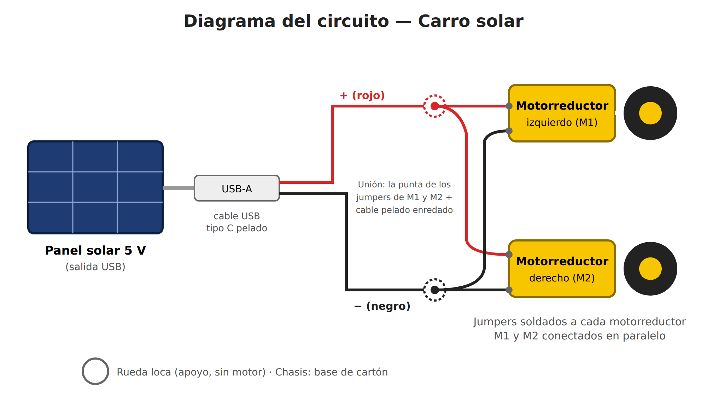
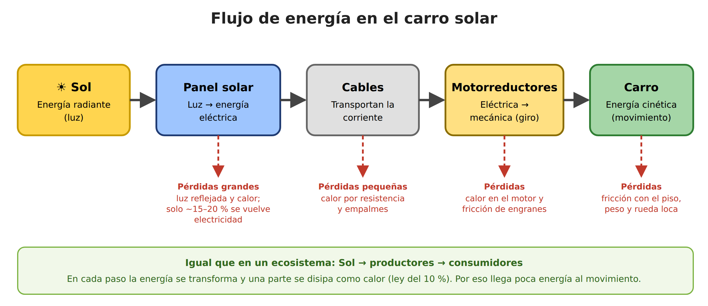
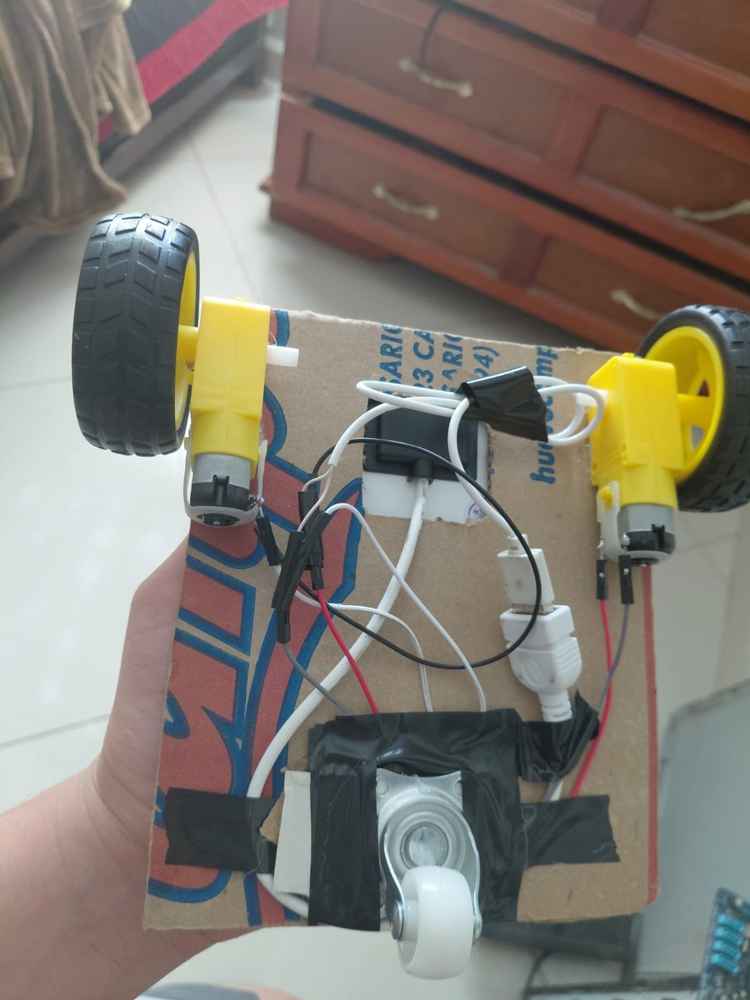
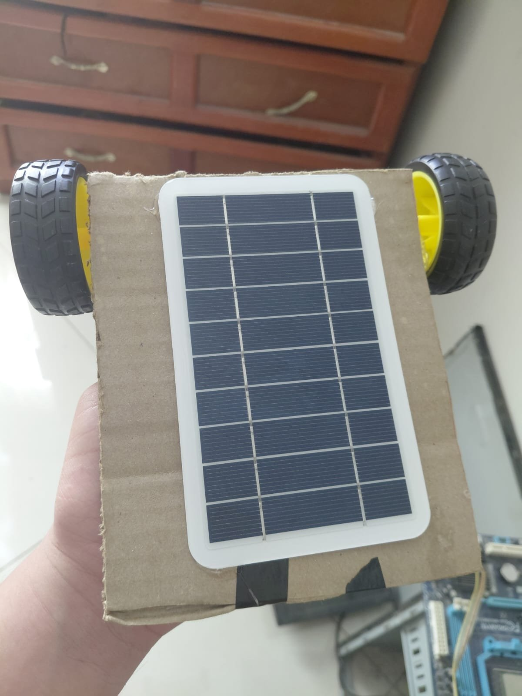

# Nombre del proyecto
Carro solar: flujo de energía del Sol al movimiento

**Alumno:** Christian Paul Lizárraga Oronia
**Materia:** Desarrollo Sustentable, Instituto Tecnológico de Mazatlán
**Tema:** 2.2 Flujo de energía (Carro panel solar)

## Descripción
Construí un carro pequeño que se mueve únicamente con energía solar. Un panel solar de 5 V, montado arriba del chasis de cartón, alimenta directamente dos motorreductores DC (los motores amarillos tipo TT) que hacen girar las llantas traseras. Adelante lleva una rueda loca como apoyo.

El carro no usa baterías, Arduino ni código, por eso esta práctica no lleva carpeta de código. Toda la energía que lo mueve viene del Sol en el momento en que funciona. Por eso el carro sirve para ver en la práctica cómo **fluye y se transforma la energía**: luz → electricidad → giro del motor → movimiento. En cada paso se pierde una parte, igual que en un ecosistema.

## Objetivos de aprendizaje
- Relacionar el flujo de energía de un ecosistema (Sol → productores → consumidores) con el de un sistema tecnológico.
- Identificar las transformaciones de energía: radiante → eléctrica → mecánica → cinética.
- Reconocer en qué partes del sistema se pierde energía (calor, fricción) y por qué llega poca energía al final.
- Armar un circuito sencillo con un panel solar y dos motores conectados en paralelo.
- Valorar la energía solar como una fuente renovable y limpia.

## Material utilizado
- Panel solar de 5 V con salida USB
- 2 motorreductores DC amarillos (tipo TT) con sus llantas
- 1 rueda loca
- Cable USB tipo C (pelado en la punta para sacar positivo y negativo)
- Adaptador / extensión USB-A
- Cables jumper
- Cautín y soldadura
- Base de cartón (chasis)
- Cinta de aislar

## Diagrama del circuito

El panel entrega la energía por su salida USB. Pelé la punta de un cable USB tipo C para sacar el cable positivo (+) y el negativo (−). A cada motorreductor le soldé un jumper en cada terminal, y la punta del jumper de un motor la conecté con la del otro motor. En esa unión de los dos jumpers enredé el cable pelado: el positivo de un lado y el negativo del otro. Así los **dos motorreductores quedan conectados en paralelo**: los dos reciben el mismo voltaje del panel y giran al mismo tiempo.

## Flujo de energía

| Etapa | Transformación | ¿Dónde se pierde energía? |
|---|---|---|
| Sol | Energía radiante (luz) | Nubes, sombra y el ángulo en que llega la luz al panel |
| Panel solar | Luz → energía eléctrica | La mayor pérdida: un panel común convierte aprox. 15–20 % de la luz en electricidad; el resto se refleja o se vuelve calor |
| Cables | Transportan la corriente | Un poco de calor por la resistencia de los cables y los empalmes |
| Motorreductores | Eléctrica → mecánica (giro) | Calor en el motor y fricción de los engranes |
| Carro | Mecánica → cinética (movimiento) | Fricción de las llantas y la rueda loca con el piso, y el peso del carro |

**Relación con el ecosistema:** en un ecosistema el Sol es la fuente de energía, las plantas (productores) la convierten en energía química y de ahí pasa a los consumidores. En cada nivel se pierde cerca del 90 % como calor (**ley del 10 %**). En el carro pasa algo parecido: el panel hace el papel del productor, los motores son como el consumidor y en cada paso se pierde energía. Por eso al final llega poca energía para mover el carro.

## Video del funcionamiento
[enlace.txt](Video/enlace.txt)

[Ver video en YouTube](VIDEO_URL)

## Evidencias de armado

| Vista inferior: motores, cableado y rueda loca | Vista superior: panel solar |
|---|---|
|  |  |

### Proceso de armado
1. Pelé la punta de un cable USB tipo C para sacar los cables positivo y negativo.
2. Conecté el cable al panel y probé un motor directamente con el sol para comprobar que sí arrancaba.
3. Soldé cables jumper a las terminales de los dos motorreductores.
4. Uní la punta de los jumpers de un motor con los del otro y en esa unión enredé el cable pelado (positivo de un lado y negativo del otro), quedando los motores en paralelo.
5. Pegué los motores con sus llantas y la rueda loca a una base de cartón.
6. Coloqué el panel solar arriba del chasis para que reciba la luz y alimente a los motores.

## Pruebas

| Prueba | Resultado | Observación |
|---|---|---|
| Un motor conectado directo al panel, al sol | ✅ El motor gira | Comprobé que el panel da suficiente energía para un motor sin carga |
| Carro completo al sol, arrancando desde parado | ⚠️ No avanza bien | Al arrancar el motor necesita más energía para vencer el peso y la fricción, y el sol no daba suficiente |
| Carro completo al sol, con un pequeño empujón | ✅ Avanza solo | Una vez en movimiento, la energía del panel alcanza para mantenerlo avanzando |

## Preguntas de reflexión

**1. ¿Qué aprendí con esta práctica?**
Aprendí que la energía no se crea ni se destruye, solo se transforma, y que en cada transformación una parte se pierde como calor o fricción. En el carro la luz del sol se convierte en electricidad en el panel, luego en giro en los motores y al final en movimiento. Es lo mismo que pasa en un ecosistema, donde la energía del Sol pasa de los productores a los consumidores y en cada nivel se va perdiendo.

**2. ¿Qué problemas tuve y cómo los resolví?**
El principal problema fue que el carro no avanzaba bien solo, porque el sol no daba la energía suficiente para arrancarlo desde parado. Un motor necesita más energía para empezar a moverse (tiene que vencer la inercia, el peso del carro y la fricción) que para mantenerse girando. Lo resolví dándole un pequeño empujón al inicio; ya en movimiento el carro avanzaba solo con la energía del panel. También tuve que soldar jumpers a los motores, unir las puntas de los jumpers de los dos motores y enredar ahí el cable pelado para que hiciera buen contacto con los dos.

**3. ¿Cómo se relaciona la práctica con el desarrollo sustentable?**
El carro funciona solo con energía solar, que es renovable y no contamina al usarse. Además lo hice con materiales reutilizados, como un cable USB viejo y cartón. La práctica muestra por qué es importante aprovechar bien la energía: como se pierde en cada paso, conviene usar sistemas eficientes y fuentes limpias en lugar de combustibles fósiles.

**4. ¿Qué mejoraría del carro?**
- Usar un panel más grande o dos paneles para tener más potencia.
- Hacer el carro más ligero y reducir la fricción de las llantas.
- Agregar un capacitor o una batería pequeña que guarde energía para el arranque.
- Inclinar el panel hacia el sol para que reciba la luz más directa.

## Conclusiones
El carro cumplió su objetivo: se movió usando solo la energía del Sol. La práctica me ayudó a ver el flujo de energía de forma real. La energía entra como luz y sale como movimiento, pero en el camino se pierde mucha, sobre todo en el panel y por la fricción. Esto explica por qué necesitó un empujón para arrancar y se parece a la ley del 10 % de los ecosistemas: al final de la cadena llega solo una parte pequeña de la energía que dio el Sol.

## Resultados
[Resultados.pdf](Resultados/Resultados.pdf)

Este documento contiene lo que se aprendió en la práctica, los problemas encontrados y cómo se solucionaron.
